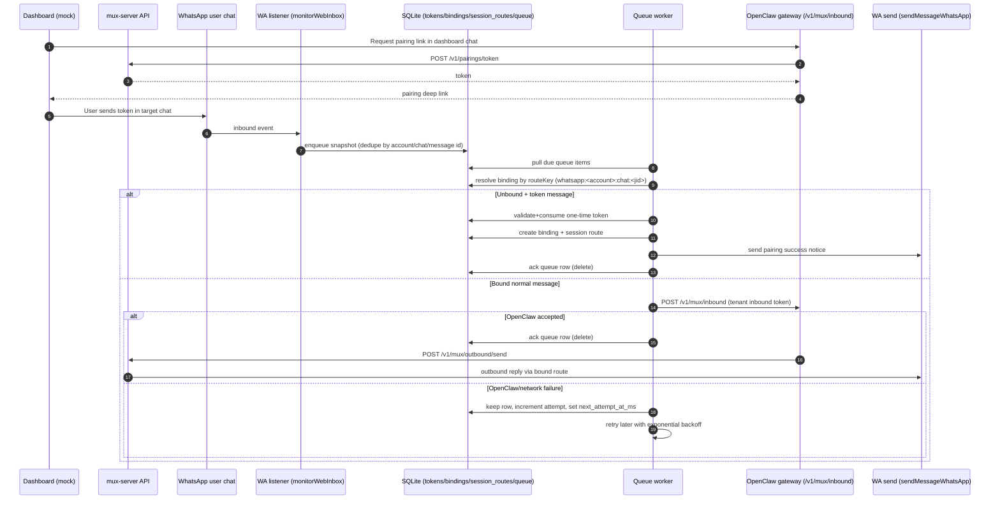

# Mux Server (Standalone)

This directory contains a standalone TypeScript mux server for staged rollout and local testing.

## Scope

- Implements `GET /health`
- Implements `GET /v1/pairings`
- Implements `POST /v1/pairings/claim`
- Implements `POST /v1/pairings/unbind`
- Implements `GET /v1/tenant/inbound-target`
- Implements `POST /v1/tenant/inbound-target`
- Implements `POST /v1/mux/outbound/send`
- Implements Telegram inbound polling + forwarding to OpenClaw `POST /v1/mux/inbound`
- Implements Discord inbound polling + forwarding to OpenClaw `POST /v1/mux/inbound`
- Implements WhatsApp inbound monitoring + forwarding to OpenClaw `POST /v1/mux/inbound`
- Supports Telegram outbound via Bot API:
  - `sendMessage` (text)
  - `sendPhoto` (image with optional caption)
- Supports Discord outbound via Bot API:
  - `POST /channels/{id}/messages` (text)
  - DM route via `POST /users/@me/channels` + channel message send
- Supports WhatsApp outbound via OpenClaw Web listener:
  - text and image sends through bound session route
- Supports idempotency via `Idempotency-Key`:
  - Same key + same payload: cached replay
  - Same key + different payload: `409`

## MVP Direction (Simplified)

- Keep one mux process for `1000-2000` users.
- Use one SQLite database for tenant authz, pairing, route bindings, and idempotency.
- Keep mux thin: route/authz checks + platform send/receive mapping only.
- No queue/bus or multi-region architecture in MVP.

## Architecture Placement

This repo now has 3 mux-related pieces:

1. `src/gateway/mux-http.ts`

- OpenClaw inbound adapter (`POST /v1/mux/inbound`)
- Validates mux bearer token from OpenClaw config
- Normalizes inbound payload into OpenClaw message context

2. `src/channels/plugins/outbound/mux.ts`

- OpenClaw outbound client
- Calls external mux server at `/v1/mux/outbound/send`

3. `mux-server/src/server.ts`

- External mux service implementation (this directory)
- Telegram + Discord + WhatsApp outbound + inbound forwarding
- Shared payload contract helpers live in `mux-server/src/mux-envelope.ts` to keep no-transform rules centralized.

In short: OpenClaw inbound/outbound adapters are in `src/`; the standalone mux service is here.

For production wiring with control plane + per-tenant OpenClaw instances, see `mux-server/INTEGRATION_PLAN.md`.

## Run

From repo root:

```bash
pnpm mux:server
```

Direct:

```bash
TELEGRAM_BOT_TOKEN="<bot-token>" \
MUX_API_KEY="outbound-secret" \
node --import tsx mux-server/src/server.ts
```

## Environment

- `TELEGRAM_BOT_TOKEN` (required): Telegram bot token.
- `DISCORD_BOT_TOKEN` (required for Discord transport): Discord bot token.
- `MUX_API_KEY` (default `outbound-secret`): legacy single-tenant key; seeds default tenant when `MUX_TENANTS_JSON` is unset.
- `MUX_TENANTS_JSON` (optional): JSON array for multi-tenant auth seed.
- `MUX_HOST` (default `127.0.0.1`)
- `MUX_PORT` (default `18891`)
- `MUX_LOG_PATH` (default `./mux-server/logs/mux-server.log`)
- `MUX_DB_PATH` (default `./mux-server/data/mux-server.sqlite`)
- `MUX_IDEMPOTENCY_TTL_MS` (default `600000`)
- `MUX_PAIRING_CODES_JSON` (optional): JSON array to seed pairing codes for testing/bootstrap.
- `MUX_OPENCLAW_INBOUND_URL` (optional, default tenant only): OpenClaw mux inbound URL.
- `MUX_OPENCLAW_INBOUND_TOKEN` (optional, default tenant only): bearer token for OpenClaw mux inbound.
- `MUX_OPENCLAW_INBOUND_TIMEOUT_MS` (default `15000`): request timeout for OpenClaw mux inbound.
- `MUX_TELEGRAM_API_BASE_URL` (default `https://api.telegram.org`): Telegram API base URL.
- `MUX_DISCORD_API_BASE_URL` (default `https://discord.com/api/v10`): Discord API base URL.
- `MUX_TELEGRAM_INBOUND_ENABLED` (default `false`): enable Telegram inbound polling and forwarding.
- `MUX_TELEGRAM_POLL_TIMEOUT_SEC` (default `25`): Telegram long-poll timeout.
- `MUX_TELEGRAM_POLL_RETRY_MS` (default `1000`): backoff after poll errors.
- `MUX_TELEGRAM_BOOTSTRAP_LATEST` (default `true`): when enabled, skips historical backlog on cold start.
- `MUX_TELEGRAM_INBOUND_MEDIA_MAX_BYTES` (default `5000000`): max file size fetched from Telegram for inbound image attachments.
- `MUX_DISCORD_INBOUND_ENABLED` (default `false`): enable Discord inbound polling and forwarding.
- `MUX_DISCORD_POLL_INTERVAL_MS` (default `2000`): Discord poll interval.
- `MUX_DISCORD_BOOTSTRAP_LATEST` (default `true`): when enabled, skips historical backlog on cold start.
- `MUX_DISCORD_INBOUND_MEDIA_MAX_BYTES` (default `5000000`): max file size fetched from Discord attachment URLs for inbound image attachments.
- `MUX_WHATSAPP_INBOUND_ENABLED` (default `false`): enable WhatsApp inbound monitoring and forwarding.
- `MUX_WHATSAPP_ACCOUNT_ID` (default `default`): WhatsApp account id to monitor.
- `MUX_WHATSAPP_AUTH_DIR` (optional): WhatsApp auth directory; defaults to OpenClaw's default web auth dir.
- `MUX_WHATSAPP_INBOUND_MEDIA_MAX_BYTES` (default `5000000`): max file size read from saved WhatsApp inbound media files for image attachments.
- `MUX_WHATSAPP_INBOUND_RETRY_MS` (default `1000`): reconnect backoff when WhatsApp listener closes.
- `MUX_TELEGRAM_BOT_USERNAME` (optional): enables Telegram deep link in pairing-token response.
- `MUX_PAIRING_TOKEN_TTL_SEC` (default `900`): default one-time pairing-token TTL in seconds.
- `MUX_PAIRING_TOKEN_MAX_TTL_SEC` (default `3600`): max allowed one-time pairing-token TTL.
- `MUX_PAIRING_SUCCESS_TEXT` (default `Paired successfully. You can chat now.`): message sent after token-based pairing succeeds.
- `MUX_PAIRING_INVALID_TEXT` (default `Pairing link is invalid or expired. Request a new link from your dashboard.`): message sent when token is invalid/reused/expired.
- `MUX_UNPAIRED_HINT_TEXT` (default `This chat is not paired yet. Open your dashboard and use a new pairing link.`): message sent when unpaired chat sends slash command (for example `/help`).

`MUX_TENANTS_JSON` format:

```json
[
  {
    "id": "tenant-a",
    "name": "Tenant A",
    "apiKey": "tenant-a-key",
    "inboundUrl": "http://127.0.0.1:18789/v1/mux/inbound",
    "inboundToken": "tenant-a-mux-inbound-token",
    "inboundTimeoutMs": 15000
  },
  { "id": "tenant-b", "name": "Tenant B", "apiKey": "tenant-b-key" }
]
```

`MUX_PAIRING_CODES_JSON` format:

```json
[
  {
    "code": "PAIR-1",
    "channel": "telegram",
    "routeKey": "telegram:default:chat:-100123",
    "scope": "chat"
  }
]
```

## API Contract

### `GET /health`

- Response: `200 {"ok":true}`

### `POST /v1/mux/outbound/send`

Headers:

- `Authorization: Bearer <tenant_api_key>`
- Optional: `Idempotency-Key: <stable-request-id>`

Body:

```json
{
  "requestId": "uuid",
  "channel": "telegram",
  "sessionKey": "tg:group:-100123:thread:2",
  "to": "-100123",
  "text": "hello",
  "mediaUrl": "https://... or Telegram file_id",
  "mediaUrls": ["https://..."],
  "replyToId": "123",
  "threadId": 2
}
```

Behavior:

- `channel` is required (`telegram`, `discord`, or `whatsapp`).
- `sessionKey` is required.
- At least one of `text`, `mediaUrl`, or `mediaUrls` is required.
- Destination is resolved from mux route mapping `(tenant, channel, sessionKey)`.
- `to` from request is ignored for Telegram and DM-bound Discord routes.
- If no route mapping exists, returns `403` with `code: "ROUTE_NOT_BOUND"`.
- Telegram: first media URL uses `sendPhoto` (with optional caption from `text`), extra media URLs are sent as additional `sendPhoto` messages.
- Discord: outbound sends text as `content` and media URLs as `embeds[].image.url` (no text+URL folding).
- WhatsApp: outbound route target is always resolved from route binding; first media item can carry caption from `text`, extra media items are sent as separate messages without caption.
- `threadId` maps to Telegram `message_thread_id`.
- `replyToId` maps to Telegram `reply_to_message_id`.
- Discord guild-bound routes validate that destination channel belongs to the bound guild.

Transport contract:

- Transport layers preserve original text and provider payload structures.
- Parsing is allowed for validation/routing and image decode, but transport must not rewrite user text.

### `POST /v1/pairings/claim`

Headers:

- `Authorization: Bearer <tenant_api_key>`

Body:

```json
{
  "code": "PAIR-1",
  "sessionKey": "tg:group:-100123:thread:2"
}
```

Response `200`:

```json
{
  "bindingId": "bind_...",
  "channel": "telegram",
  "scope": "chat",
  "routeKey": "telegram:default:chat:-100123",
  "sessionKey": "tg:group:-100123:thread:2"
}
```

### `POST /v1/pairings/token`

Headers:

- `Authorization: Bearer <tenant_api_key>`

Body:

```json
{
  "channel": "telegram",
  "sessionKey": "tg:group:-100123:thread:2",
  "ttlSec": 900
}
```

Discord body variant:

```json
{
  "channel": "discord",
  "routeKey": "discord:default:dm:user:4242",
  "sessionKey": "dc:dm:4242",
  "ttlSec": 900
}
```

WhatsApp body variant:

```json
{
  "channel": "whatsapp",
  "sessionKey": "wa:chat:15550001111@s.whatsapp.net",
  "ttlSec": 900
}
```

Response `200`:

```json
{
  "ok": true,
  "channel": "telegram",
  "token": "mpt_...",
  "expiresAtMs": 1770459999999,
  "startCommand": "/start mpt_...",
  "deepLink": "https://t.me/<bot>?start=mpt_..."
}
```

Behavior:

- Token is opaque, one-time, and tenant-scoped.
- Telegram: user sends token to bot (manual token message or `/start <token>` deep link).
- Discord: `routeKey` is required and currently supports `dm` route only (`discord:default:dm:user:<userId>`).
- Discord: token issuance creates a pending DM binding; sending token in that DM activates it.
- WhatsApp: user sends token as a normal message in the target chat; mux binds that chat route to tenant/session.
- Mux binds route from the incoming chat/topic to this tenant and consumes token.
- The token message is not forwarded to OpenClaw; subsequent messages are forwarded.
- Invalid or reused tokens return a user-facing notice (configured by `MUX_PAIRING_INVALID_TEXT`).
- Unpaired slash commands (for example `/help`) return a pairing hint notice (configured by `MUX_UNPAIRED_HINT_TEXT`).

### `GET /v1/pairings`

Headers:

- `Authorization: Bearer <tenant_api_key>`

Response `200`:

```json
{
  "items": [
    {
      "bindingId": "bind_...",
      "channel": "telegram",
      "scope": "chat",
      "routeKey": "telegram:default:chat:-100123"
    }
  ]
}
```

### `POST /v1/pairings/unbind`

Headers:

- `Authorization: Bearer <tenant_api_key>`

Body:

```json
{
  "bindingId": "bind_..."
}
```

Response `200`:

```json
{ "ok": true }
```

### `GET /v1/tenant/inbound-target`

Headers:

- `Authorization: Bearer <tenant_api_key>`

Response `200`:

```json
{
  "ok": true,
  "configured": true,
  "inboundUrl": "http://127.0.0.1:18789/v1/mux/inbound",
  "inboundTimeoutMs": 15000
}
```

### `POST /v1/tenant/inbound-target`

Headers:

- `Authorization: Bearer <tenant_api_key>`

Body:

```json
{
  "inboundUrl": "http://127.0.0.1:18789/v1/mux/inbound",
  "inboundToken": "tenant-a-mux-inbound-token",
  "inboundTimeoutMs": 15000
}
```

Behavior:

- Updates the tenant's forwarding target in SQLite immediately.
- No mux restart required.

## Reliability Notes

### Idempotency

- Current code stores idempotency entries in SQLite with tenant scope:
- key: `(tenantId, idempotencyKey)`
- compare: request fingerprint
- replay: cached status/body
- Duplicate keys survive process restart.

### Restart Behavior

From local restart drills:

- During restart windows, callers can see transport errors (`code=000`, empty reply, connection reset).
- Some requests may still be processed even if client did not receive a response.

Recommended caller contract:

1. Generate a stable request id per logical send.
2. Reuse it as `Idempotency-Key` on every retry.
3. Retry on network/5xx with backoff.
4. Treat unknown-ack windows as retriable, not hard-fail.

### Delivery Semantics Upgrade (Implemented)

Goal: avoid silent inbound message loss when OpenClaw forwarding fails.

Scope:

- Telegram inbound poller (offset-based)
- Discord inbound poller (offset-based)
- WhatsApp inbound listener (event callback based)

Behavior:

- A message is acknowledged only after one of these:
- forwarded to OpenClaw successfully
- intentionally consumed by mux (for example pairing token command)
- If forwarding fails, do not acknowledge that message.
- Retry failed messages in order.

Implementation checklist:

- [x] Telegram: replaced commit-in-finally offset flow with ack-safe commit flow
- [x] Telegram: stop processing newer updates after first failed forward
- [x] Discord: commit only the last acknowledged message id per binding
- [x] Discord: keep earlier successful messages committed even if a later message fails in the same batch
- [x] WhatsApp: added SQLite-backed pending inbound queue
- [x] WhatsApp: enqueue first, then forward worker marks done only on success
- [x] WhatsApp: retry queue items with backoff; do not drop on first failure
- [x] Logging: explicit `ack_committed` and `retry_deferred` events per channel
- [ ] Tests: add WhatsApp failure-then-retry regression test

Out of scope for this pass:

- Exactly-once guarantee end-to-end
- Distributed queue or multi-node delivery coordination
- Cross-region failover logic

## Telegram-Specific Notes

- `mediaUrl` accepts either an internet URL or Telegram `file_id`.
- Forum topics are preserved when `threadId` is provided.
- Replies can be pinned to parent message with `replyToId`.
- Inbound forwarding uses route bindings first (`topic` then chat fallback) and emits OpenClaw mux-inbound events with a stable `sessionKey`.
- Media-only Telegram messages are preserved as:
- `attachments[]` (base64 image) when image fetch succeeds
- `channelData.telegram.media[]` metadata always
- `body` remains original text/caption only (empty string when no text)
- `channelData.telegram.rawMessage` and `channelData.telegram.rawUpdate` preserve original Telegram payload

## Inbound Data Flow


Notes:

- Forwarding target is tenant-specific (`inboundUrl`, `inboundToken` from tenant config).
- Forwarding target is resolved dynamically from SQLite on each inbound forward.
- Inbound auth is enforced by OpenClaw `gateway.http.endpoints.mux.token`.
- Telegram and Discord offsets are committed only after acked processing.
- WhatsApp inbound is persisted in SQLite queue and retried with backoff until acked.

## WhatsApp Data Flow



## OpenClaw Command Note

In Telegram + OpenClaw flows:

- `/help` is Telegram slash-command style.
- `!help` may be interpreted as command/bang syntax by OpenClaw.

## Tests

From repo root:

```bash
pnpm --dir mux-server typecheck
pnpm --dir mux-server test
```

Smoke checks (against a running mux server):

```bash
pnpm --dir mux-server smoke
```

Optional live outbound check:

```bash
MUX_API_KEY=outbound-secret \
MUX_SESSION_KEY='tg:group:-1003712260705:thread:2' \
MUX_EXPECT_STATUS=200 \
pnpm --dir mux-server smoke
```

Current test coverage (`mux-server/test/server.test.ts`):

- health endpoint responds
- outbound endpoint rejects unauthorized requests
- multi-tenant auth via `MUX_TENANTS_JSON`
- pairing claim/list/unbind flow
- duplicate pairing claim conflict handling
- dynamic tenant inbound target update without restart
- outbound route resolution from `(tenant, channel, sessionKey)` mapping
- Telegram inbound forwarding to tenant inbound endpoint
- Telegram retry without offset advance on failed forward
- Telegram media-only inbound forwarding with attachment payload preservation
- Discord inbound forwarding with raw payload + media attachment preservation
- Discord retry without replaying already-acked earlier messages
- dashboard token pairing via `/start <token>` then forwarding subsequent messages
- idempotency replay + payload mismatch handling
- idempotency persistence across process restart
